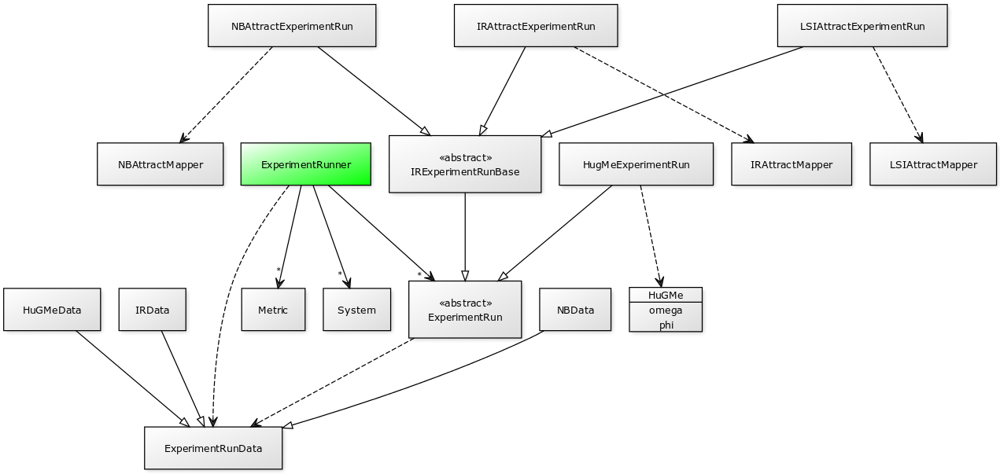

# Adding a new type of Mapper
This documentation describes the steps of adding a new type of mapper. The job of a mapper is to assign an orphan to an architectural module. To aid in this work there are a number of non-orphans that are already mapped to the modules.

## Experiment Subsystem
The most important aspect to understand is the experiment sub-system and how it works. The following UML diagram gives an overview of the current design. The starting class is the ExperimentRunner. This is where systems are loaded, experiments executed and results saved.
The basic steps to implement a new mapper would be to
1. Create the mapper, included examples are HuGMe, NBAttractMapper, IRAttractMapper, and LSIAttractMapper.
2. Create the mapper specific ExperimentRun subclass. If the mapper is based on information retrieval you can consider inheriting from IRExperimentRunBase.
3. Create the specific data ExperimentRunData subclass and modify RundDataCSVFileSaver to save the data in csv format.
4. Modify ExperimentXMLPersistence to save mapper and mapper parameters to XML

## GUI
To be able to use a new mapper in the graphical user interface a few modifications is needed.
1. Add the new mapper to the available mappers in X
2. Add the parameters of the new mapper Y

